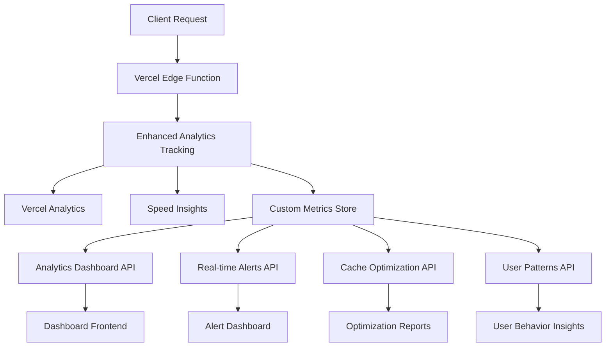

# InsightFlo Analytics System - Complete Integration Guide

Comprehensive analytics and performance monitoring system for InsightFlo API with Vercel Analytics, Speed Insights, and custom metrics tracking.

## Architecture Overview



## Features

### 🎯 Core Analytics Features
- ✅ **Vercel Web Analytics**: Production-ready web vitals tracking
- ✅ **Speed Insights**: Core Web Vitals and performance monitoring
- ✅ **Enhanced Performance Metrics**: Custom metrics with deep insights
- ✅ **Real-time Alerting**: Configurable threshold-based alerts
- ✅ **Cache Optimization**: Comprehensive cache analysis and recommendations
- ✅ **User Pattern Analysis**: Behavioral insights and segmentation
- ✅ **Personalization Tracking**: Algorithm effectiveness monitoring

### 📊 Analytics Endpoints

#### 1. Analytics Dashboard
**GET `/api/analytics/dashboard`**

Comprehensive performance dashboard with real-time metrics.

```json
{
  "timeRange": "24h",
  "summary": {
    "totalRequests": 2847,
    "averageResponseTime": 267,
    "cacheHitRate": 73,
    "errorRate": 1.1,
    "uniqueUsers": 789
  },
  "performance": {
    "responseTimeDistribution": {
      "p50": 245,
      "p95": 567,
      "p99": 890
    },
    "regionPerformance": {
      "icn1": { "averageResponseTime": 245, "requestCount": 1250, "errorRate": 0.8 }
    }
  }
}
```

**Query Parameters:**
- `timeRange`: `1h` | `24h` | `7d` | `30d` (default: `24h`)
- `metrics`: `performance` | `usage` | `cache` | `all` (default: `all`)
- `userId`: Filter by specific user (optional)
- `endpoint`: Filter by specific endpoint (optional)

#### 2. Real-time Performance Alerts
**GET `/api/analytics/alerts`** - Get current alerts and system health
**POST `/api/analytics/alerts/configure`** - Configure alert thresholds

```json
{
  "activeAlerts": [
    {
      "type": "performance",
      "severity": "warning",
      "message": "Average response time elevated",
      "currentValue": 1250,
      "threshold": 1000,
      "timestamp": "2024-01-20T15:30:00Z"
    }
  ],
  "systemHealth": {
    "overallStatus": "warning",
    "components": {
      "api": "healthy",
      "cache": "warning", 
      "personalization": "healthy",
      "database": "healthy"
    }
  }
}
```

**Alert Configuration:**
```json
{
  "responseTimeThreshold": 2000,
  "cacheHitRateThreshold": 70,
  "errorRateThreshold": 5,
  "relevanceScoreThreshold": 0.6,
  "alertCooldownPeriod": 300
}
```

#### 3. Cache Optimization Reports
**GET `/api/analytics/cache-optimization`**

Detailed cache performance analysis with optimization recommendations.

```json
{
  "currentStatus": {
    "totalCacheSize": 456,
    "utilizationPercentage": 67,
    "globalHitRate": 73,
    "avgHitResponseTime": 85,
    "avgMissResponseTime": 450
  },
  "optimization": {
    "overallScore": 78,
    "opportunities": [
      {
        "category": "ttl",
        "priority": "high",
        "title": "Optimize Cache TTL Settings",
        "estimatedImpact": {
          "hitRateImprovement": 15,
          "responseTimeReduction": 300,
          "costSavings": 25
        }
      }
    ]
  }
}
```

#### 4. User Pattern Analysis
**GET `/api/analytics/user-patterns`**

Comprehensive user behavior analysis and segmentation.

```json
{
  "userSegmentation": {
    "segments": [
      {
        "name": "Power Users",
        "userCount": 156,
        "percentage": 23,
        "characteristics": {
          "avgRequestsPerDay": 47,
          "preferredSortMode": "relevance",
          "avgArticlesRequested": 32
        },
        "engagementScore": 89
      }
    ]
  },
  "temporalPatterns": {
    "peakUsageHours": ["09:00", "14:00", "20:00"],
    "seasonalTrends": {
      "pattern": "Business hours peak with weekend dips",
      "confidence": 0.85
    }
  }
}
```

## Implementation Guide

### 1. Vercel Analytics Setup

#### Install Dependencies
```bash
npm install @vercel/analytics @vercel/speed-insights
```

#### Environment Variables
Add to Vercel project settings:
```bash
# Analytics Configuration
VERCEL_ANALYTICS_ID=your-analytics-id
NEXT_PUBLIC_VERCEL_ANALYTICS_ID=your-analytics-id

# Enhanced Analytics (optional)
ANALYTICS_DATABASE_URL=your-analytics-db-url
ANALYTICS_API_KEY=your-analytics-api-key
```

#### Basic Integration
```typescript
import { track } from '@vercel/analytics/server';
import { trackEnhancedMetrics } from '@/utils/analytics-enhanced';

// In your API endpoint
export default async function handler(req: NextRequest) {
  const startTime = Date.now();
  
  // Your API logic here
  const response = await processRequest(req);
  
  // Track with Vercel Analytics
  await track('api_request', {
    endpoint: '/api/news/personalized',
    processing_time: Date.now() - startTime,
    status_code: response.status
  });
  
  // Enhanced tracking
  await trackEnhancedMetrics({
    endpoint: '/api/news/personalized',
    processingTime: Date.now() - startTime,
    cacheStatus: 'HIT',
    userId: userId,
    // ... other metrics
  });
  
  return response;
}
```

### 2. Custom Analytics Integration

#### Enhanced Performance Tracking
```typescript
import { 
  trackEnhancedMetrics,
  trackPersonalizationMetrics,
  trackUserBehavior,
  PerformanceMonitor
} from '@/utils/analytics-enhanced';

// Configure performance monitoring
const monitor = PerformanceMonitor.getInstance();
monitor.setThreshold('responseTime', 2000);
monitor.setThreshold('cacheHitRate', 70);

// Add alert callback
monitor.addAlertCallback((alert) => {
  console.error('Performance Alert:', alert);
  // Send to Slack, email, etc.
});

// Track comprehensive metrics
await trackEnhancedMetrics({
  endpoint: '/api/news/personalized',
  processingTime: 267,
  cacheStatus: 'HIT',
  userId: 'user-123',
  relevanceScore: 0.84,
  algorithmWeights: {
    keywordMatch: 0.4,
    symbolMatch: 0.3,
    sentimentWeight: 0.2,
    timeDecay: 0.1
  }
});
```

#### Personalization Effectiveness Tracking
```typescript
await trackPersonalizationMetrics({
  userId: 'user-123',
  relevanceScore: 0.84,
  componentScores: {
    keywordMatchScore: 0.78,
    symbolMatchScore: 0.69,
    sentimentScore: 0.72,
    timeDecayScore: 0.83,
    portfolioRelevanceScore: 0.91
  },
  diversityMetrics: {
    categorySpread: 0.85,
    sourceSpread: 0.73,
    sentimentSpread: 0.67,
    timeSpread: 0.89
  }
});
```

### 3. Real-time Alerting Setup

#### Configure Alert Thresholds
```bash
curl -X POST https://insightflo-api.vercel.app/api/analytics/alerts/configure \
  -H "Authorization: Bearer <jwt_token>" \
  -H "Content-Type: application/json" \
  -d '{
    "responseTimeThreshold": 2000,
    "cacheHitRateThreshold": 70,
    "errorRateThreshold": 5,
    "relevanceScoreThreshold": 0.6
  }'
```

#### Monitor Alerts
```typescript
// Check alerts programmatically
const response = await fetch('/api/analytics/alerts', {
  headers: { 'Authorization': `Bearer ${token}` }
});

const { activeAlerts, systemHealth } = await response.json();

if (systemHealth.overallStatus === 'critical') {
  // Trigger emergency protocols
  await notifyOnCall();
}
```

### 4. Dashboard Integration

#### Fetch Dashboard Data
```typescript
const dashboardData = await fetch('/api/analytics/dashboard?timeRange=24h&metrics=all', {
  headers: { 'Authorization': `Bearer ${token}` }
}).then(res => res.json());

// Use data in your dashboard components
const { summary, performance, cacheAnalysis } = dashboardData;
```

#### Cache Optimization Reports
```typescript
const optimizationReport = await fetch('/api/analytics/cache-optimization?timeRange=7d', {
  headers: { 'Authorization': `Bearer ${token}` }
}).then(res => res.json());

// Display optimization opportunities
optimizationReport.optimization.opportunities.forEach(opportunity => {
  console.log(`${opportunity.title}: ${opportunity.estimatedImpact.hitRateImprovement}% improvement`);
});
```

## Performance Targets

### Response Time Targets
- **Dashboard API**: <500ms (P95)
- **Alerts API**: <200ms (P95)
- **Cache Optimization**: <800ms (P95)
- **User Patterns**: <1000ms (P95)

### Cache Performance
- **Hit Rate Target**: >80%
- **Hit Response Time**: <100ms
- **Miss Response Time**: <2000ms

### Alert Thresholds
- **Critical**: Response time >2000ms, Error rate >5%
- **Warning**: Response time >1000ms, Cache hit rate <70%
- **Info**: General system events and cache misses

## Rate Limiting

### API Endpoint Limits
- **Dashboard**: 20 requests/minute
- **Alerts**: 30 requests/minute
- **Cache Optimization**: 10 requests/minute
- **User Patterns**: 15 requests/minute

### Best Practices
- Cache dashboard data client-side for 5-10 minutes
- Use webhooks for real-time alerts instead of polling
- Batch analytics requests when possible
- Implement client-side rate limiting

## Security Considerations

### Authentication
- All analytics endpoints require JWT authentication
- User-specific data filtering based on authentication
- Admin-only access for system-wide analytics

### Data Privacy
- User data is anonymized in analytics logs
- PII is not stored in analytics systems
- GDPR-compliant data retention policies

### Access Control
```typescript
// Role-based access example
if (userRole === 'admin') {
  // Access to all analytics data
} else if (userRole === 'user') {
  // Access to own data only
  analyticsData = filterByUserId(analyticsData, userId);
}
```

## Monitoring and Alerting

### System Health Monitoring
```yaml
Health Checks:
  - API response times (<500ms target)
  - Cache hit rates (>70% target)
  - Error rates (<2% target)
  - Memory utilization (<80% target)
  - Database connectivity

Alert Channels:
  - Slack integration for immediate alerts
  - Email notifications for critical issues
  - PagerDuty for production emergencies
  - Dashboard notifications for warnings
```

### Custom Metrics
```typescript
// Track custom business metrics
await track('user_engagement', {
  action: 'article_view',
  user_id: userId,
  article_id: articleId,
  time_spent: timeSpent,
  relevance_score: relevanceScore
});

await track('conversion_funnel', {
  step: 'personalized_news_view',
  user_id: userId,
  converted: userBookmarked,
  funnel_stage: 'awareness'
});
```

## Analytics Dashboard Examples

### Performance Dashboard
```typescript
const PerformanceDashboard = () => {
  const [data, setData] = useState(null);
  
  useEffect(() => {
    fetchAnalytics('/api/analytics/dashboard?timeRange=24h')
      .then(setData);
  }, []);
  
  return (
    <div>
      <MetricCard 
        title="Response Time"
        value={`${data?.performance.responseTimeDistribution.p95}ms`}
        status={data?.performance.responseTimeDistribution.p95 < 1000 ? 'good' : 'warning'}
      />
      <CacheChart data={data?.cacheAnalysis} />
      <AlertsList alerts={data?.alerts} />
    </div>
  );
};
```

### User Segmentation
```typescript
const UserSegmentation = () => {
  const [patterns, setPatterns] = useState(null);
  
  useEffect(() => {
    fetchAnalytics('/api/analytics/user-patterns?timeRange=7d')
      .then(setPatterns);
  }, []);
  
  return (
    <div>
      {patterns?.userSegmentation.segments.map(segment => (
        <SegmentCard 
          key={segment.name}
          name={segment.name}
          userCount={segment.userCount}
          engagementScore={segment.engagementScore}
          characteristics={segment.characteristics}
        />
      ))}
    </div>
  );
};
```

## Troubleshooting

### Common Issues

**1. High Response Times**
```bash
# Check alerts
curl -H "Authorization: Bearer $TOKEN" \
  https://insightflo-api.vercel.app/api/analytics/alerts

# Analyze cache performance
curl -H "Authorization: Bearer $TOKEN" \
  https://insightflo-api.vercel.app/api/analytics/cache-optimization
```

**2. Low Cache Hit Rates**
- Check TTL settings in cache configuration
- Analyze cache optimization recommendations
- Monitor memory utilization and eviction patterns

**3. Analytics Data Missing**
- Verify Vercel Analytics environment variables
- Check API authentication and rate limits
- Review error logs in Vercel dashboard

### Debug Mode
```bash
# Enable debug logging
NODE_ENV=development

# This will log detailed analytics information
```

## Cost Optimization

### Analytics Cost Management
- Use appropriate cache TTLs for analytics data
- Implement intelligent sampling for high-volume metrics
- Archive old analytics data to cheaper storage
- Use Vercel Analytics built-in cost controls

### Performance vs Cost Balance
```typescript
// Implement smart sampling
const shouldSample = (endpoint: string, userId: string) => {
  // Always sample errors and slow requests
  if (responseTime > 2000 || statusCode >= 400) return true;
  
  // Sample 10% of normal requests
  return Math.random() < 0.1;
};

if (shouldSample(endpoint, userId)) {
  await trackEnhancedMetrics(metrics);
}
```

## Future Enhancements

- [ ] Machine learning-based anomaly detection
- [ ] Predictive analytics for capacity planning
- [ ] A/B testing framework integration
- [ ] Real-time streaming analytics dashboard
- [ ] Advanced user journey tracking
- [ ] Automated optimization recommendations

---

The InsightFlo Analytics System provides comprehensive monitoring and insights for API performance, user behavior, and system optimization. With real-time alerting, detailed cache analysis, and user pattern recognition, teams can make data-driven decisions to improve user experience and system performance.